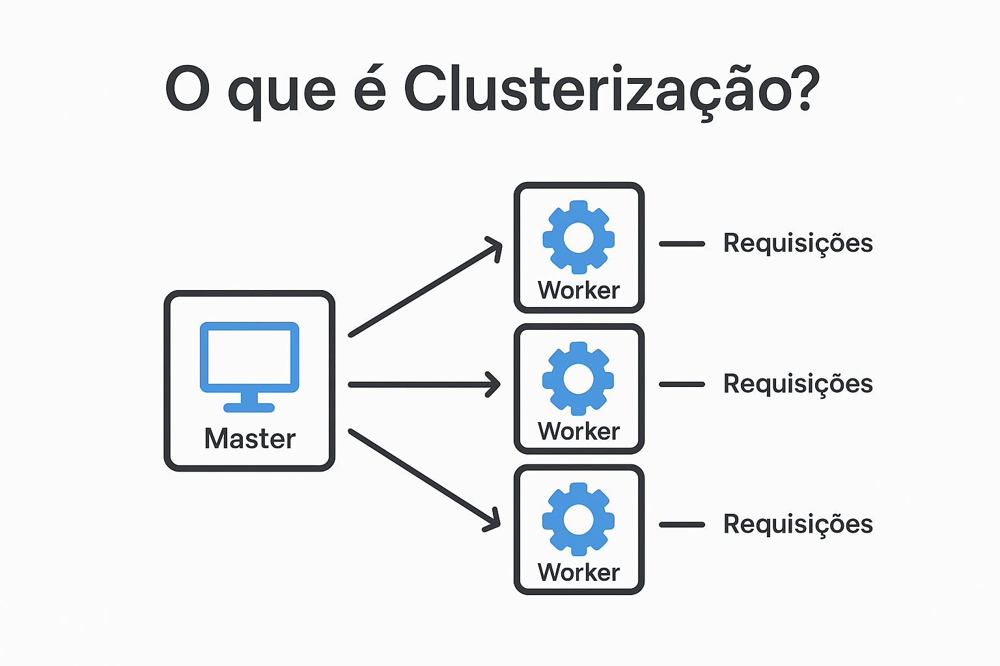

# 🖥️ O que é Clusterização?

**Clusterização** é a técnica de usar **vários processos** para
aproveitar melhor os **múltiplos núcleos de CPU** de uma máquina.

No contexto do **Node.js**: - O Node normalmente roda em **apenas um
núcleo** (single-thread). - Com `cluster`, podemos criar **múltiplos
processos trabalhadores (workers)**. - Cada worker pode atender
requisições de forma independente. - Isso melhora o **desempenho** e a
**escalabilidade** da aplicação.

------------------------------------------------------------------------

## 🔑 Conceito Visual

-   **Master (processo principal):** gerencia os workers.
-   **Workers (processos filhos):** lidam com as requisições.
-   Se um worker cair, o master pode criar outro.
-   Cada worker roda em um núcleo diferente da CPU.

