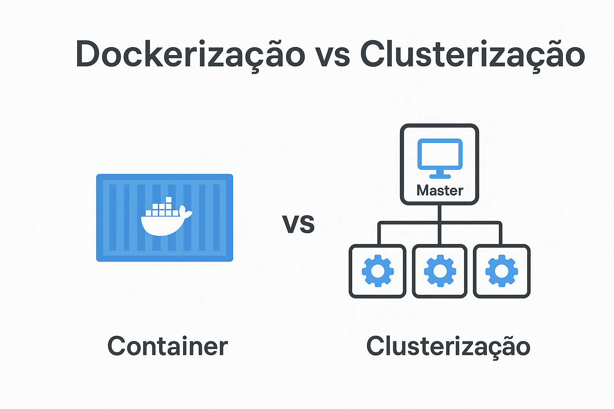

# 🐳 Dockerização e Suas Diferenças em Relação à Clusterização

## 🚀 O que é Dockerização?

**Dockerização** é o processo de empacotar uma aplicação e todas as suas dependências em um **container** para que ela seja executada de forma consistente em qualquer ambiente.

### Benefícios:

-   **Portabilidade:** roda da mesma forma no seu computador, em servidores ou na nuvem.
-   **Isolamento:** cada container tem seu próprio sistema de arquivos e dependências.
-   **Escalabilidade:** é fácil subir várias instâncias de um container.

## 🔄 Diferença entre Dockerização e Clusterização

| Aspecto            | Dockerização                                           | Clusterização                                    |
|--------------------|--------------------------------------------------------|------------------------------------------------- |
| **Objetivo**       | Empacotar e isolar aplicações                          | Escalar uso de CPU distribuindo processos        |
| **Escopo**         | Ambiente de execução completo                          | Somente o processo da aplicação                  |
| **Portabilidade**  | Alta — roda em qualquer sistema com Docker             | Baixa — depende do SO e do Node.js               |
| **Escalabilidade** | Horizontal (subindo vários containers)                 | Horizontal, mas limitado aos núcleos da máquina  |
| **Gerenciamento**  | Feito por ferramentas como Docker CLI ou Kubernetes    | Feito pelo próprio Node via módulo `cluster`     |
| **Uso típico**     | Microserviços, ambientes isolados                      | Aplicações que precisam usar todos os núcleos de CPU |

## 📝 Resumo

-   **Dockerização:** resolve o problema de ambiente e empacotamento.
-   **Clusterização:** resolve o problema de uso eficiente de múltiplos núcleos de CPU.
-   Muitas vezes as duas técnicas são usadas **juntas**: você pode **dockerizar** uma aplicação Node.js e, dentro do container, usar **clusterização** para melhor desempenho.

