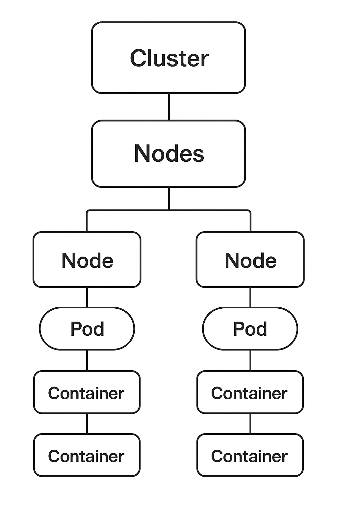

# ☸️ Kubernetes - Guia Didático

## 📖 O que é Kubernetes?

**Kubernetes** é uma plataforma **open-source** para **orquestração de
containers**.\
Ele automatiza o **deploy**, **escalonamento** e **gerenciamento** de
aplicações em containers.

Em outras palavras, ele é como um "sistema operacional para o seu
datacenter":\
diz aos servidores **o que rodar, quando rodar e como se recuperar se
algo falhar**.

------------------------------------------------------------------------

## 🎯 Para que serve?

-   **Gerenciar containers** de forma centralizada.
-   **Escalar aplicações** automaticamente (mais réplicas quando há mais
    tráfego).
-   **Balancear carga** entre diferentes instâncias de uma aplicação.
-   **Autocorreção**: reinicia containers que falham.
-   **Atualizações sem downtime** (rolling updates).
-   **Descrever a infraestrutura como código** (YAML/manifestos).

## 🐳 Kubernetes x Docker

| Aspecto                  | Docker                                   | Kubernetes                                            |
|--------------------------|------------------------------------------|-------------------------------------------------------|
| **O que é**              | Plataforma para criar e rodar containers | Plataforma para orquestrar e gerenciar containers     |
| **Foco**                 | Empacotamento e execução de uma aplicação| Coordenação de várias aplicações em vários containers |
| **Escopo**               | Um único nó (máquina)                    | Vários nós (cluster de máquinas)                      |
| **Escalabilidade**       | Manual (precisa subir containers à mão)  | Automática (Horizontal Pod Autoscaler)                |
| **Rede**                 | Básica (bridge network)                  | Rede interna unificada entre nós e pods               |
| **Alta disponibilidade** | Depende de você configurar               | Nativo — replicasets, failover e load balancing       |

💡 **Importante:** Docker e Kubernetes **não são concorrentes** — eles se complementam.  
Você usa **Docker para criar containers** e **Kubernetes para gerenciá-los em produção**.


## 🔗 Como usar Docker + Kubernetes em conjunto

1.  **Docker** empacota sua aplicação:

    ``` bash
    docker build -t minha-app .
    docker push minha-app
    ```

2.  **Kubernetes** recebe um manifesto YAML que descreve como rodar a
    aplicação:

    ``` yaml
    apiVersion: apps/v1
    kind: Deployment
    metadata:
      name: minha-app
    spec:
      replicas: 3
      selector:
        matchLabels:
          app: minha-app
      template:
        metadata:
          labels:
            app: minha-app
        spec:
          containers:
          - name: minha-app
            image: minha-app:latest
            ports:
            - containerPort: 3000
    ```

3.  **Aplicar no cluster:**

    ``` bash
    kubectl apply -f deployment.yaml
    ```

4.  **Escalar automaticamente:**

    ``` bash
    kubectl scale deployment minha-app --replicas=5
    ```

------------------------------------------------------------------------

## 🏗️ Conceitos Básicos do Kubernetes

-   **Cluster:** conjunto de máquinas (nós) gerenciadas pelo Kubernetes.
-   **Node:** cada máquina que roda containers.
-   **Pod:** menor unidade do Kubernetes -- pode conter um ou mais
    containers.
-   **Deployment:** descreve como os pods devem ser criados e
    atualizados.
-   **Service:** expõe os pods para dentro ou fora do cluster.
-   **ConfigMap / Secret:** para variáveis de ambiente e dados
    sensíveis.
-   **Ingress:** roteia tráfego HTTP para os serviços.

------------------------------------------------------------------------

## 📌 Resumo

-   Docker resolve **empacotamento**.
-   Kubernetes resolve **orquestração**.
-   Juntos, são a base para rodar aplicações modernas em **produção**,
    com **alta disponibilidade**, **resiliência** e **escalabilidade**.

